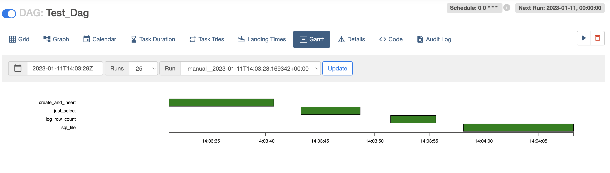

apache-airflow-providers-sqream-blue
=====================================
Apache Airflow is a popular open source orchestration tool. It allows users to write complex workflows composed of multiple kinds of actions and services using DAGs, and to schedule, debug and monitor workflow runs.

Different kind of actions are represented with specialized Python classes, called “Operators”. Each SaaS database vendor can build one or more customized Operators for performing different DB operations (e.g. execute arbitrary SQL statements, schedule DB job runs etc.).

This package is an Operator for executing SQL statments on SQream Blue using Python connector.

Requirements
-------------

* Python 3.9+

Installing the Airflow-provider-sqream-blue
-------------------------------------------
The Airflow provider sqream-blue is available via `PyPi <https://pypi.org/project/airflow-provider-sqream-blue/>`_.

Install the connector with ``pip3``:

.. code-block:: console

    pip3 install airflow-provider-sqream-blue

``pip3`` will automatically installs all necessary libraries and modules.

How to use the Airflow-provider-sqream-blue
-------------------------------------------
Create a connection - 

After the installation of the package on the Airflow server, 
refresh the server and create a new connection.
sqream-blue will apper on the connection-type.

Click test and save after enter connection params.

Create a dag - 
   
Create a python dag file and copy it to dags folder on the airflow server -
    
To find dag folder run this command

.. code-block:: console
    
    airflow config list | grep dags_folder

Example of python dag file

.. code-block:: python

    import logging
    from datetime import timedelta
    from airflow import DAG
    from airflow.operators.python_operator import PythonOperator
    from sqream_blue.operators.sqream_blue import SQreamBlueSqlOperator
    from sqream_blue.hooks.sqream_blue import SQreamBlueHook
    from airflow.utils.dates import days_ago

    logging.basicConfig(level=logging.INFO)
    logger = logging.getLogger(__name__)

    with DAG(
        dag_id='Test_Dag',
        schedule_interval='0 0 * * *',
        start_date=days_ago(2),
        dagrun_timeout=timedelta(minutes=60),
        template_searchpath=['/home/sqream/'],
        tags=['Test']
    ) as dag:

    list_operator = SQreamBlueSqlOperator(
        task_id='create_and_insert',
        sql=['create or replace table t_a(x int not null)', 'insert into t_a values (1)', 'insert into t_a values (2)'],
        sqream_blue_conn_id="sqream_blue_connection",
        dag=dag,
    )

    simple_operator = SQreamBlueSqlOperator(
        task_id='just_select',
        sql='select * from t_a',
        sqream_blue_conn_id="sqream_blue_connection",
        dag=dag,
    )

    sql_file_operator = SQreamBlueSqlOperator(
        task_id='sql_file',
        sql='daniel.sql',
        sqream_blue_conn_id="sqream_blue_connection",
        dag=dag,
    )

    def count_python(**context):
        dwh_hook = SQreamBlueHook(sqream_blue_conn_id="sqream_blue_connection")
        result = dwh_hook.get_first("select count(*) from public.t_a")
        logging.info("Number of rows in `public.t_a`  - %s", result[0])

    count_through_python_operator_query = PythonOperator(
        task_id="log_row_count",
        python_callable=count_python)

    list_operator >> simple_operator >> count_through_python_operator_query >> sql_file_operator

The execution of the Dag File -

 
